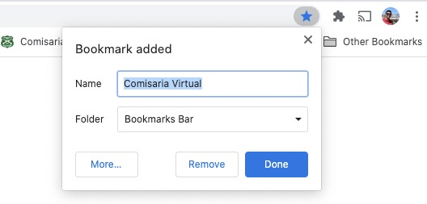
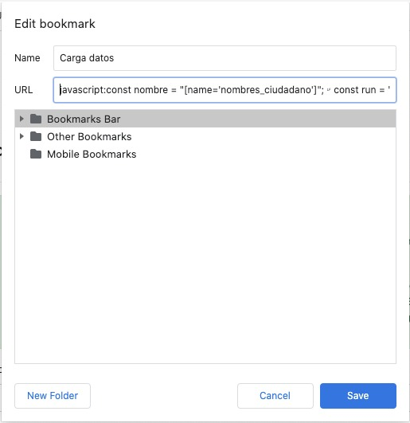

# Carga de datos comisariavirtual.cl

**INFO**: Este es un proyecto de colaboración y tiene por objetivo dar una idea de cómo facilitar la usabilidad del sitio [comisaría virtual](https://comisariavirtual.cl/tramites/iniciar/103.html) para el 
**Permiso Temporal para Compras** cargando automáticamente los datos ingresados anteriormente por el usuario.

## Como se usa
El proyecto tiene dos archivos, los que se explican a continuación:

* **[saveUserData](./saveUserData.js)**: Este archivo es un ejemplo en javascript plano (sin un framework en particular) para que los Devs de Carabineros tengan una referencia de como guardar los datos la primera vez que son ingresados y como cargarlos la próxima vez que el usuario ingrese al sitio.

Es muy sencillo y solo almacena los datos dentro del navegador usando **[localStorage](https://developer.mozilla.org/es/docs/Web/API/Window/localStorage)**, respetando la privacidad y seguridad del usuario.

* **[jsInjection](./jsInjection.js)**: Este archivo es un ejemplo para los **usuarios** (tu, si tu), mientras nuestros amigos Devs de Carabineros desarrollan la funcionalidad oficial, y permite crear el ejemplo como un marcador del navegador, para realizar el almacenamiento y la carga de los datos.

También es muy sencillo, y para hacerlo debes seguir los siguientes pasos:

## Instrucciones para Google Chrome en PC de escritorio:

1) ingresa al trámite [Permiso Temporal para Compras](https://comisariavirtual.cl/tramites/iniciar/103.html)

2) Presiona la estrellita que está al final en tu barra de direcciones. (Es lo que haces para crear un marcador / página en favoritos) deberia salir un cuadrito como el siguiente.

3) Click en el botón **Más** el que dice *More...* en la fotito anterior.

4) Como **nombre** puedes poner lo que quieras peeeero, pongamos "Carga datos" o lo que te haga sentido.

5) OJO AQUI!, ahora en el campo **URL** donde dice *https://comisariavirtual.cl/tramites/iniciar/103.html* vas a borrar eso y vas a escribir:

    **javascript:**

6) a continuación vas a pegar todo el contenido del archivo **[jsInjection](./jsInjection.js)**.

Debería quedar como la siguiente imágen:

7) De ahora en adelante al ingresar al [Permiso Temporal para Compras](https://comisariavirtual.cl/tramites/iniciar/103.html) presiona el marcador/favorito que quedo en tu navegador.

8) Al pedir un permiso los datos serán guardados por primera vez, y al pedir permisos futuros permisos y presionar el marcador/favorito se cargarán automáticamente los datos.

9) **IMPORTANTE**: Espero que esto **NO LO TENGAS QUE USAR NUNCA** y que te **QUEDES EN TU CASA**, pero si tienes que salir obligado, bueno este es mi aporte para hacer menos fea esta pandemia.

Saludos,
Felipe Velásquez.

